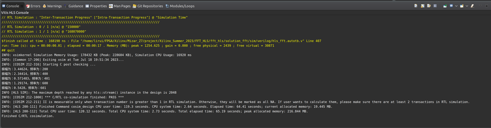
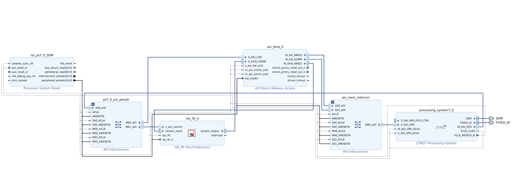
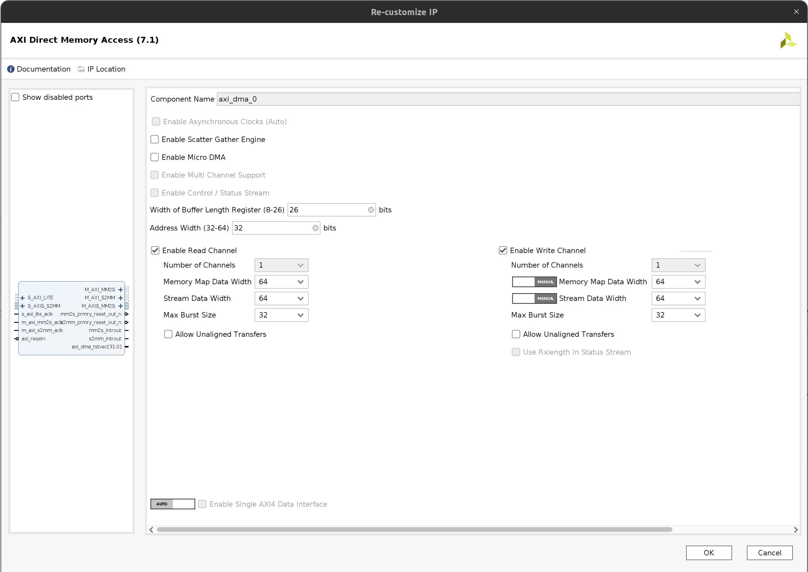

# 硬件FFT频谱可视化加速实验设计

## 目标

- 使用HLS构建项目并仿真、综合、导出IP
- 使用Vivado对导出的IP集成
- 使用PYNQ设计简单的应用

## 环境

- PYNQ开发板
- Vivado HLS
- Vivado

### 实验步骤

> 相信看到这里的开发者已经有一定的基础，便直接进行设计思路的介绍

#### 1.在Vitis HLS中设计FFT IP

1. 创建HLS工程。
2. 在工程中添加设计文件和仿真文件。

> `src`目录下`hls_fft.cpp`和`hls_fft.h`是设计文件，`hls_fft_test.cpp`是仿真文件，`wave.txt`是仿真	所需的数据文件，内容是频率为200、400、600，振幅分别为7、5、3的波形文件。

3. 依次进行`C-Simulation`、`C-Synthesis`、`C/RTL Co-simulation`和IP导出（设计的FFT最大长度为2048,为保证正确性，频谱可视化的频率应该在1000Hz以下）。

> 下面是仿真结果：
>
> 
>
> 可以看到仿真结果与波形文件的频率相符，位于200Hz、400Hz和600Hz处。

### 2.在Vivado中集成

1. 创建Vivado工程并添加IP库。
2. 创建`Block Design`并添加相应IP，最后完成的设计如图所示：

> 1. 其中`AXI DMA`的配置为：
>
> 
>
> 2. 连线
>    1. axi_dma_0::M_AXIS_MM2S to fft_hls_0::stream_input
>    2. axi_dma_0::S_AXIS_S2MM to fft_hls_0::stream_output
>    3. 然后点击自动连线`Run Connection Automation`。
>    4. 完整连线请看`2`。

3. 综合生成并导出比特流

   

### 3. PYNQ设计

1. 提取`fft.bit`和`fft.hwh`。
2. 访问`Jupyter`。
3. 上传`fft.bit`、`fft.hwh`和`FFT_from_PYNQ.ipynb`。
4. 部署运行Oerlay。

